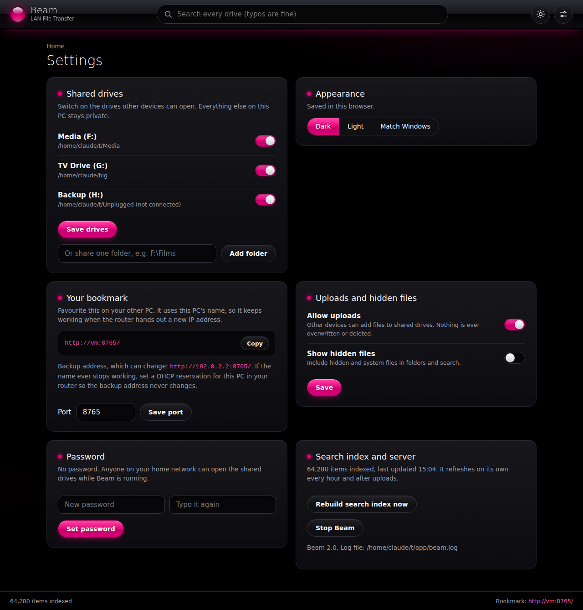

# Beam

**Open your other PC's drives in a web browser. Search them, drag files in and out. No cloud, no accounts, no cost.**

Two PCs in the same house, and one of them has the files: a Plex server full of USB drives, an old desktop, a NAS box. Getting a file across usually means uploading it to someone's cloud and downloading it again 30 centimetres away, or losing an evening to Windows network sharing.

Beam is one Python file. Run it on the PC with the drives, bookmark the address it gives you, and every other device on your home network gets a fast, searchable view of those drives.


## What it does

- **Finds your drives itself.** USB and internal drives are detected automatically. Tick the ones to share, and nothing else on the PC is reachable.
- **Search that forgives typos.** Search every drive at once as you type. "inseption", "braking bad pilot" and "peeky blindrs s04" all find the right thing, in milliseconds, even across tens of thousands of files.
- **Drag and drop both ways.** Drop files or whole folders onto the page to upload them. In Chrome or Edge you can drag a file *out* of the page straight onto your desktop.
- **Downloads that resume** if the connection drops, **ZIP a whole folder** in one click, and preview videos, music, images and PDFs in the browser.
- **A bookmark that keeps working.** The address uses the PC's name rather than its IP, so it survives the router handing out new addresses.
- **Dark and light themes**, working nicely on phones too.
- **Never deletes or overwrites anything.** An upload that clashes with an existing name is saved as `name (1).ext`.
- **Optional password**, start-with-Windows, and a stop button, all in Settings.
- **Nothing to install** apart from Python. Standard library only.

## Quick start (Windows)

1. **Install Python** from [python.org/downloads](https://www.python.org/downloads/). On the installer's first screen, tick **"Add python.exe to PATH"**.
2. **Download Beam:** the green **Code** button above, then **Download ZIP**. Unzip it somewhere permanent on the PC with the drives, such as `Documents\Beam`.
3. **Double-click `Start File Transfer.bat`.** On the first run, Beam opens its Settings page so you can choose which drives to share.
4. **When Windows Firewall asks, tick "Private networks" and click Allow.** If you skip this, other PCs can't connect.
5. **On your other PC**, open the **Bookmark** address shown in the Beam window (something like `http://plex-pc:8000/`) and favourite it.

To have Beam running whenever the PC is on, switch on **Start with Windows** in Settings.

## Screenshots

| Home | A folder |
|---|---|
|  |  |
| **Uploading** | **Settings** |
|  |  |

More in [`docs/screenshots`](docs/screenshots). They were taken on a test machine, so the paths and PC name differ from what you'll see.

## Mac and Linux

Beam runs anywhere Python 3.8+ does:

```
python3 lan_file_transfer.py
```

Then open `http://localhost:8000/settings` on that machine and add the folders to share by path. Automatic drive detection and start-at-login are Windows-only for now.

## Security

Beam is designed for a **trusted home network**. Here is what protects you:

- Only the drives and folders you tick are reachable, and tricks for escaping them (`..`, symlinks, junctions, Windows alternate data streams) are blocked.
- Settings can only be changed on the PC running Beam, unless you set a password.
- Passwords are stored as salted PBKDF2 hashes. Sign-in cookies are signed, and repeated wrong guesses trigger a lockout.
- Other websites can't use your browser to upload files or change settings (origin checks plus a custom header), and Beam ignores requests addressed to names other than its own (DNS rebinding protection).
- Files from your drives are never rendered as web pages, so a shared `.html` or `.svg` file can't run scripts.

And here are the limits, so you can decide for yourself:

- **Without a password, anyone on your home network can browse the shared drives while Beam is running.** If you have guests or flatmates on your Wi-Fi, set one.
- **Traffic is plain HTTP, not encrypted.** That's normal for a home LAN, but it means someone on the same network could, in principle, watch files and passwords go past. Don't run Beam on public or untrusted networks.
- **Never expose Beam to the internet** through port forwarding. It isn't built for that.

Found a problem? See [SECURITY.md](SECURITY.md).

## Troubleshooting

**The other PC can't connect.** Check both PCs are on the same network. On the Beam PC, go to Settings → Network & Internet and make sure the network is set to **Private**, not Public. If you clicked Cancel on the firewall prompt, open *Windows Security → Firewall & network protection → Allow an app through firewall* and tick **Python** under Private.

**The bookmark address doesn't work, but the backup IP address does.** Some routers don't pass PC names around. Set a **DHCP reservation** for the Beam PC in your router settings, then bookmark the IP address instead. It will stay the same from then on.

**"Port 8000 is already in use".** Beam is probably already running, perhaps in the background via Start with Windows, so just open the bookmark. If another program owns that port, change `"port"` in `beam_settings.json`.

**"Python isn't installed".** Reinstall Python and tick **"Add python.exe to PATH"** on the first screen.

**Something else.** `beam.log`, next to the script, records errors, uploads and downloads.

## Files Beam creates

Both are created next to `lan_file_transfer.py`:

- `beam_settings.json`: your settings. It holds your password hash and a signing secret, so don't share it. (It's already in `.gitignore`.)
- `beam.log`: a rotating log, capped at about 4 MB in total.

## Running the tests

```
python tests/smoke_test.py
```

This starts a real Beam server and checks browsing, typo-tolerant search, uploads, downloads, resume, ZIPs and the security checks. GitHub Actions runs it on Windows, macOS and Linux for every change.

## Licence

[MIT](LICENSE). Use it, change it, share it.
