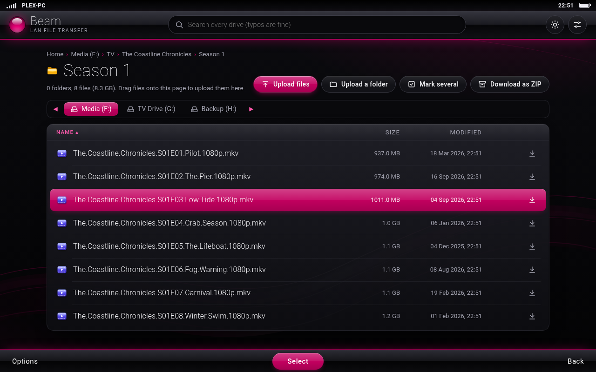
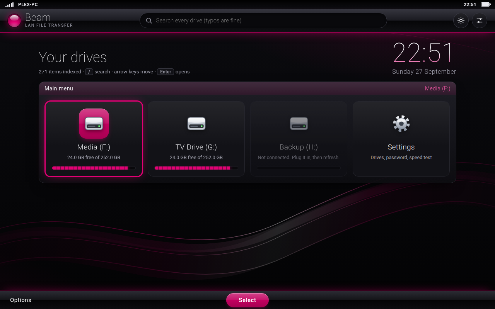
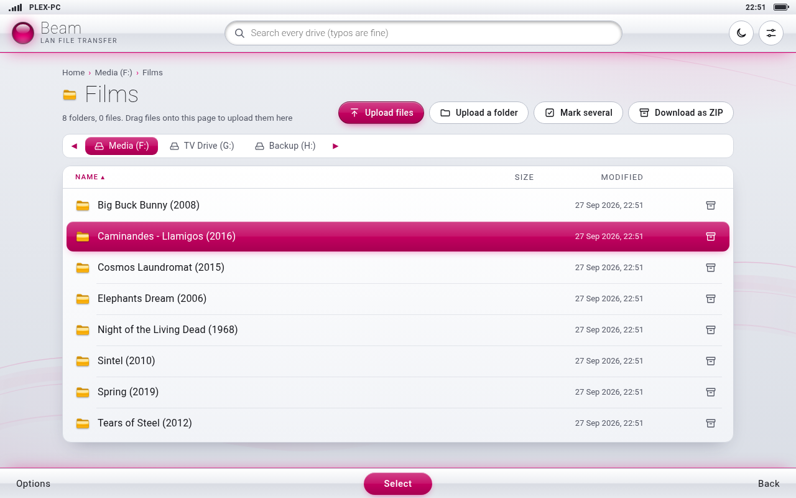
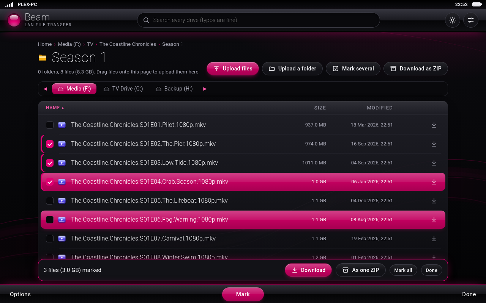
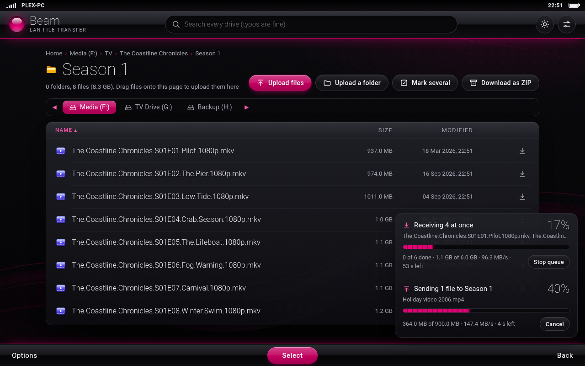
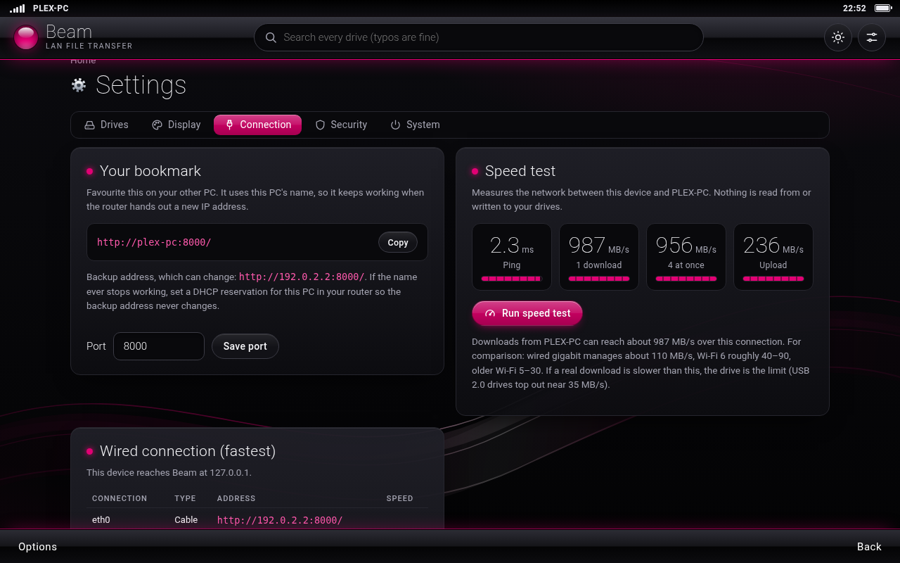
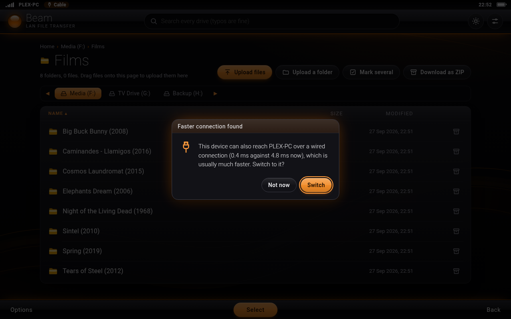
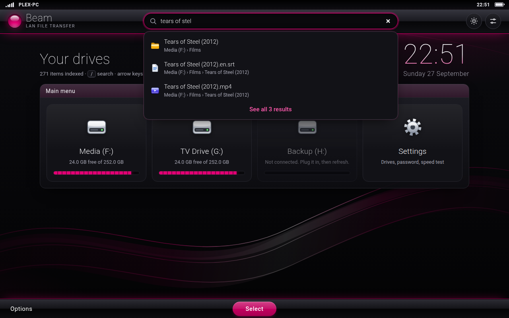
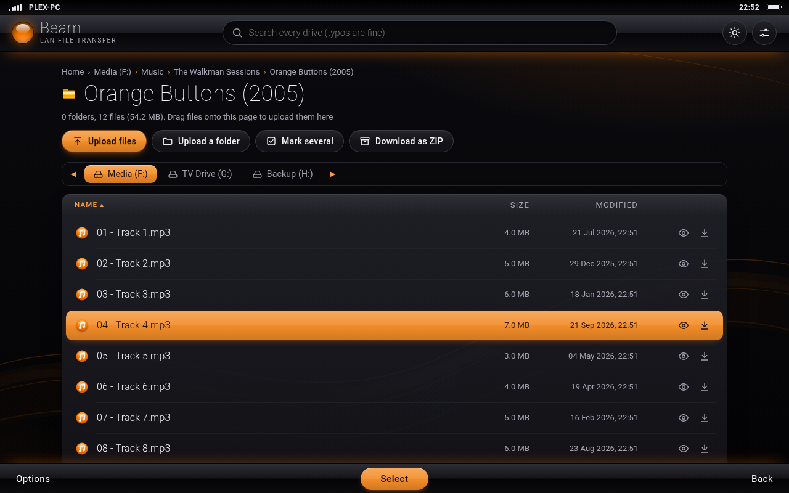

# Beam

**Open your other PC's drives in a web browser. Search them, drag files in and out, download a whole batch at full speed. No cloud, no accounts, no cost.**

Two PCs in the same house, and one of them has the files: a Plex server full of USB drives, an old desktop, a NAS box. Getting a file across usually means uploading it to someone's cloud and downloading it again 30 centimetres away, or losing an evening to Windows network sharing.

Beam is one Python file. Run it on the PC with the drives, bookmark the address it gives you, and every other device on your home network gets a fast, searchable view of those drives, dressed up like the menu of a mid-2000s phone.



## What it does

- **Finds your drives itself.** USB and internal drives are detected automatically. Tick the ones to share, and nothing else on the PC is reachable.
- **Fast over Wi-Fi.** Downloads stream from the drive in large chunks with little overhead (zero-copy on Mac and Linux), and on Windows big transfers get the larger send buffer Wi-Fi needs. **Mark several** files (or a whole season) and Beam downloads four at a time, which fills a Wi-Fi link far better than one after another, while the page stays quick to use. The next file starts the instant one finishes, and Beam works around Chrome's limit of ten page-started downloads a second, so a batch of photos goes as fast as the network allows. While files are moving, the Beam PC won't doze off halfway through.
- **Even faster over a cable.** Join the two PCs with a network cable and Beam notices the wired route, offers to switch to it, and walks you through the one Windows setting a direct cable needs.
- **Search that forgives typos.** Search every drive at once as you type. "inseption", "braking bad pilot" and "peeky blindrs s04" all find the right thing, in milliseconds even across hundreds of thousands of files, and a season's episodes come back in order.
- **Drag and drop both ways.** Drop files or whole folders onto the page to upload them, three at a time. In Chrome or Edge you can drag a file *out* of the page straight onto your desktop.
- **Downloads that resume** if the connection drops, **ZIP a folder or just the marked items** with a proper progress bar and time left, and preview videos, music, images and PDFs in the browser.
- **A built-in speed test** shows what your network can really do, one download at a time and four at once.
- **Looks and works like a 2000s phone menu.** Thin, light lettering (each device's own: Segoe UI Light on Windows, Roboto Thin on Android, SF on Apple), a big thin standby clock, flowing light ribbons in the wallpaper, signal bars (which really measure the connection), soft keys along the bottom (Options, Select, Back), a glossy highlight bar you steer with the arrow keys, and five colour themes in dark or light.
- **A bookmark that keeps working.** The address uses the PC's name rather than its IP, so it survives the router handing out new addresses.
- **Never deletes or overwrites anything.** An upload that clashes with an existing name is saved as `name (1).ext`.
- **Optional password**, start-with-Windows, and a stop button, all in Settings.
- **Nothing to install** apart from Python. Standard library only.

## Quick start (Windows)

1. **Install Python** from [python.org/downloads](https://www.python.org/downloads/). On the installer's first screen, tick **"Add python.exe to PATH"**.
2. **Download Beam:** the green **Code** button above, then **Download ZIP**. Unzip it somewhere permanent on the PC with the drives, such as `Documents\Beam`.
3. **Double-click `Start File Transfer.bat`.** On the first run, Beam opens its Settings page so you can choose which drives to share.
4. **When Windows Firewall asks, tick "Private networks" and click Allow.** If you skip this, other PCs can't connect.
5. **On your other PC**, open the **Bookmark** address shown in the Beam window (something like `http://plex-pc:8000/`) and favourite it.

To have Beam running whenever the PC is on, switch on **Start with Windows** in Settings > System.

## Fastest transfers

**Several files:** open the folder, choose **Mark several** (or Options > Mark several), tick what you want (Shift-click ticks a run), then **Download**. Beam keeps four downloads going at once and shows their combined speed and time left. The first time, your browser may ask whether Beam may download multiple files: choose **Allow**. **As one ZIP** puts the marked items in a single download instead.

**Every file in a folder:** Options > **Download all files** does the same for everything in the folder.

**Is the Beam PC itself on Wi-Fi?** Then every download crosses the air twice: PC to router, then router to your device. Plugging the Beam PC into the router with a network cable can nearly double Wi-Fi download speeds, with everything else staying on Wi-Fi. Settings > Connection shows a tip when this applies.

**Over a cable (the megarapid option):** Wi-Fi is fine for everyday use, but a cable is several times faster and much steadier.

- *Both PCs plugged into the router by cable?* You're already there; nothing to change.
- *A cable straight between the two PCs:*
  1. Plug an ordinary network cable into both PCs. Wi-Fi can stay on.
  2. Wait about a minute. With no router on the cable, Windows gives each PC an automatic address starting `169.254.`
  3. Windows usually treats that cable as a **Public** network, and its firewall then blocks Beam on it. Settings > Connection on the Beam PC flags this and has a button to make it Private (Windows asks for permission), plus the PowerShell command if you'd rather do it yourself.
  4. Open Beam on the other PC as usual. It spots the wired route and offers to switch (look for **Cable** in the status bar), or open the cable address shown in Settings > Connection.

**Not sure where the bottleneck is?** Run the **speed test** in Settings > Connection. It measures the network only, never your drives. If real downloads are much slower than the test, the drive is the limit: USB 2.0 drives top out around 35 MB/s. For comparison, wired gigabit manages about 110 MB/s, Wi-Fi 6 roughly 40 to 90 MB/s, and older Wi-Fi 5 to 30 MB/s.

## Keys

| Key | Does |
|---|---|
| <kbd>↑</kbd> <kbd>↓</kbd> | Move the highlight |
| <kbd>Enter</kbd> or <kbd>→</kbd> | Open (→ opens folders) |
| <kbd>←</kbd> or <kbd>Backspace</kbd> | Back up a level |
| <kbd>/</kbd> | Jump to search |
| <kbd>Space</kbd> | Mark or unmark, in Mark several |
| <kbd>Esc</kbd> | Close menus, stop marking |

The soft keys along the bottom are **Options** (everything you can do on that page), **Select** and **Back**.

## Screenshots

| Main menu | A folder |
|---|---|
|  |  |
| **Mark several** | **Downloading and uploading** |
|  |  |
| **Speed test** | **A faster route found** |
|  |  |
| **Typo-tolerant search** | **Colour themes** |
|  |  |

More in [`docs/screenshots`](docs/screenshots), including phone-sized ones. They were taken on a test machine with made-up files, so paths and sizes differ from what you'll see.

## Mac and Linux

Beam runs anywhere Python 3.8+ does:

```
python3 lan_file_transfer.py
```

Then open `http://localhost:8000/settings` on that machine and add the folders to share by path. Automatic drive detection and start-at-login are Windows-only for now; spotting a wired route works on Windows and Linux.

## Security

Beam is designed for a **trusted home network**. Here is what protects you:

- Only the drives and folders you tick are reachable, and tricks for escaping them (`..`, symlinks, junctions, Windows alternate data streams) are blocked.
- Hidden and system files and folders (like `.ssh` or `AppData`) can't be opened, even by typing their address, unless you switch on **Show hidden files**.
- Uploads never replace anything, and Beam refuses hidden files and the Windows files that make Explorer act just by showing a folder (`desktop.ini`, shortcuts, `.url`, `.scf` and similar).
- Settings can only be changed on the PC running Beam, unless you set a password.
- Passwords are stored as salted PBKDF2 hashes. Sign-in cookies are signed, and repeated wrong guesses trigger a lockout. Switching to the cable address uses a one-time link that expires after two minutes.
- Other websites can't use your browser to upload files or change settings (origin checks plus a custom header), and Beam ignores requests addressed to names other than its own (DNS rebinding protection). Its pages only run Beam's own script.
- Files from your drives are never rendered as web pages, so a shared `.html` or `.svg` file can't run scripts.

And here are the limits, so you can decide for yourself:

- **Without a password, anyone on your home network can browse the shared drives while Beam is running.** If you have guests or flatmates on your Wi-Fi, set one.
- **Traffic is plain HTTP, not encrypted.** That's normal for a home LAN, but it means someone on the same network could, in principle, watch files and passwords go past. Don't run Beam on public or untrusted networks.
- **Never expose Beam to the internet** through port forwarding. It isn't built for that.
- Sharing a whole user folder (`C:\Users\You`) isn't a good idea even with hidden files off; share the folders you need.

Found a problem? See [SECURITY.md](SECURITY.md).

## Troubleshooting

**The other PC can't connect.** Check both PCs are on the same network. On the Beam PC, go to Settings → Network & Internet and make sure the network is set to **Private**, not Public. If you clicked Cancel on the firewall prompt, open *Windows Security → Firewall & network protection → Allow an app through firewall* and tick **Python** under Private.

**Downloads are slow.** Run the speed test in Settings > Connection. If the test is slow too, it's the network: move closer to the router, use the 5 GHz band, plug the Beam PC into the router with a cable if it's on Wi-Fi, or use a cable between the PCs. If the test is fast but files are slow, it's the drive (older USB drives and USB 2.0 ports are the usual culprits). For lots of files, use Mark several so four run at once.

**The cable doesn't work, or Beam doesn't offer it.** Give Windows a minute after plugging in. Then check Settings > Connection on the Beam PC: if the cable network is marked Public, make it Private there. Some PCs need the cable connection's IP settings left on "Automatic (DHCP)" for the automatic 169.254 address to appear.

**My browser asks about downloading multiple files.** That's Mark several starting its batch. Choose Allow; the browser remembers it for Beam.

**The bookmark address doesn't work, but the backup IP address does.** Some routers don't pass PC names around. Set a **DHCP reservation** for the Beam PC in your router settings, then bookmark the IP address instead. It will stay the same from then on.

**"Port 8000 is already in use".** Beam is probably already running, perhaps in the background via Start with Windows, so just open the bookmark. If another program owns that port, change `"port"` in `beam_settings.json`.

**"Python isn't installed".** Reinstall Python and tick **"Add python.exe to PATH"** on the first screen.

**Something else.** `beam.log`, next to the script, records errors, uploads and downloads (with their speeds).

## Files Beam creates

Both are created next to `lan_file_transfer.py`:

- `beam_settings.json`: your settings. It holds your password hash and a signing secret, so don't share it. (It's already in `.gitignore`.)
- `beam.log`: a rotating log, capped at about 4 MB in total.

## Running the tests

```
python tests/unit_test.py
python tests/smoke_test.py
```

The unit tests check the building blocks: that the fast search gives exactly the same matches as scanning every word, that ZIPs are valid and exactly the size announced, and the path, upload and sign-in safety rules. The smoke test starts a real Beam server and checks browsing, search, uploads, downloads, resume, ZIPs, keep-alive, compression, the speed test and the security checks. GitHub Actions runs both on Windows, macOS and Linux for every change.

## Licence

[MIT](LICENSE). Use it, change it, share it.
